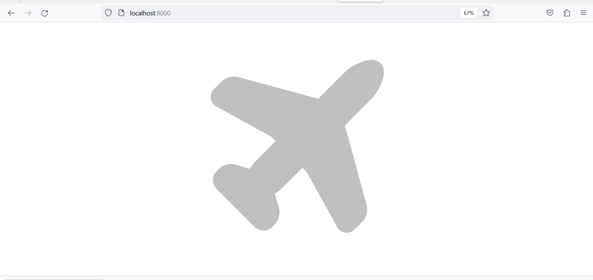

## Overview
This project was developed using Laravel. It's an API, as part of Travell Web Application. 
[Click here](https://github.com/50enta/vm-ui.git) to find the complementary part (UI).

### Requirements
- php 7.4
- composer
- DBMS Management

Notes
> As we a dealing with public data APIs, I've left my api keys on .env.example file. I know isn't a best practice.

## Project setup
1. Clone the repository
```
git clone https://github.com/50enta/vm-api.git -b main
```
2. Create a database on your prefered DMBS

3. Inside the project folder, make a copy of `.env.example` file and modify following lines:

```
DB_CONNECTION=
DB_HOST=
DB_PORT=
DB_DATABASE=
DB_USERNAME=
DB_PASSWORD=
...
WEATHER_API_KEY=
CURRENCY_API_KEY=
```
save the file and execute following commands:

4. composer setup
```
composer install
php artisan key:generate
php artisan passport:install
```
Now your project is able to run on `http://localhost:8000` before running `php artisan serve` for development purpose.



5. Using following Endpoint and PayLoad, POST your first user (No authentication needed):
Endpoint
```
http://localhost:8000/api/users
```

PayLoad
```
{
    "name": "Valter",
    "surname": "Sitoe",
    "email": "vsitoe@email.com",
    "password": "xxxxxxxx"
}
```


